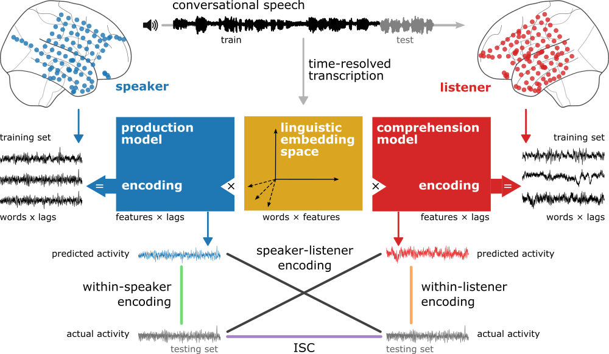

# Brain-to-brain coupling in a shared linguistic embedding space during natural conversations

Effective communication hinges on a mutual understanding of word meaning in different contexts. We hypothesize that the embedding space learned by large language models can serve as an explicit model of the shared, context-rich meaning space humans use to communicate their thoughts. We recorded brain activity using electrocorticography during spontaneous, face-to-face conversations in five pairs of epilepsy patients. We demonstrate that the linguistic embedding space can capture the linguistic content of word-by-word neural alignment between speaker and listener. Linguistic content emerged in the speaker’s brain before word articulation and the same linguistic content rapidly reemerged in the listener’s brain after word articulation. These findings establish a computational framework to study how human brains transmit their thoughts to one another in real-world contexts.

# code
A list and description of the main scripts used to preprocess the data, run the analyses, and visualize them.

## preprocessing

1. `audioalign.py` checks alignment between signal and electrodes.
1. `preprocess.py` runs the preprocessing pipeline (despike, re-reference, filter, etc)
1. `plotbrain.py` generates brain plots per electrode

## QA

1. `triggeraverage.py` runs an ERP analysis per electrode.
1. `audioxcorr.py` computes cross-correlation betweeen each electrode and the audio

## encoding

1. generate embeddings with `embeddings.py`
1. `encoding.py` fits linear models onto all electrodes and lags
1. [choose electrodes in `electrode-info.ipynb`] after running phase shuffled permutations
1. `figures.ipynb` generates all figures
1. requires `sigtest.py` to generate null distributions for ISE

## dependencies

See `environment.yml` for detals. 